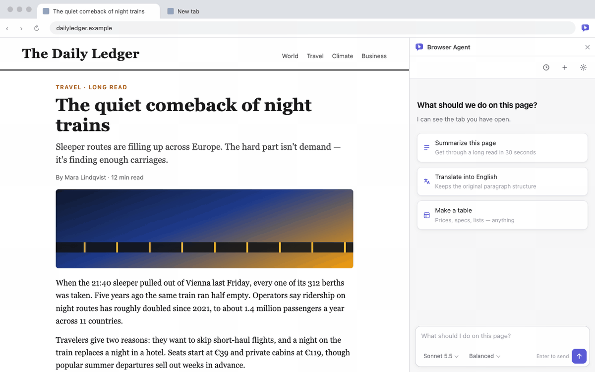
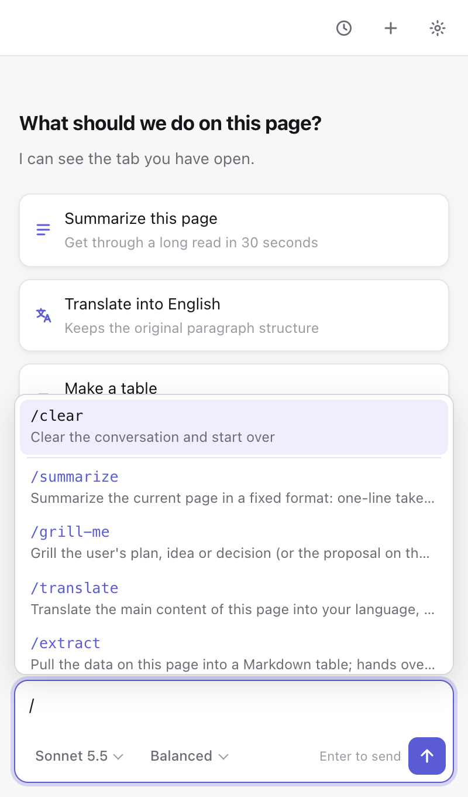
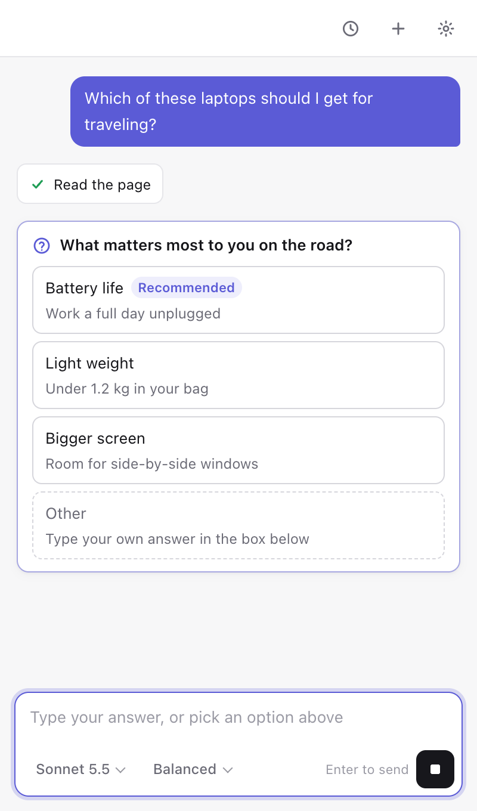
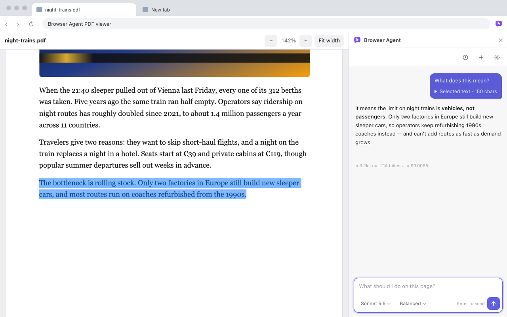

<div align="center">


# Browser Agent

**An AI agent in your browser that works directly on the site you're looking at. It reads the page, clicks, types and moves between pages for you — and when one page isn't enough, it researches across the web and answers with sources.**

[](https://github.com/io-software-ai/browser-agent/actions/workflows/ci.yml)
[](https://chromewebstore.google.com/detail/browser-agent/iebcachfohpddakkmnopkpfnjibdlhai)
[](https://github.com/io-software-ai/browser-agent/releases/latest)
[](LICENSE)


English · [繁體中文](README.zh-TW.md) · [简体中文](README.zh-CN.md) · [日本語](README.ja.md) · [한국어](README.ko.md) · [Español](README.es.md) · [Français](README.fr.md) · [Deutsch](README.de.md) · [Português (Brasil)](README.pt-BR.md) · [Italiano](README.it.md) · [Русский](README.ru.md) · [Tiếng Việt](README.vi.md) · [Bahasa Indonesia](README.id.md) · [ไทย](README.th.md) · [Türkçe](README.tr.md)



</div>

## Why

- **It works on the page you're already on.** Ask in plain words: summarize this, pull the prices into a table, fill in this form, find the cancellation setting. It reads the page and acts on it — no copy-pasting into a chat tab.
- **It sees the page the way the site built it.** The model gets the page text and a numbered list of buttons, links and fields, and clicks `ref: 12` instead of guessing from a screenshot. Select a paragraph to ask about just that; PDFs work too.
- **It can research, with sources.** When the answer isn't on this page, it searches with your own browser, reads a handful of pages, compares them and answers with `[n]` citations that link back to each source.
- **Risky actions wait for you.** Clicks and form submissions that look irreversible, and pages at addresses the agent made up itself, stop until you press *Allow*. That check is enforced by the extension's code, not by asking the model nicely.
- **Start free, or bring your own key.** Out of the box it runs on Browser Agent Cloud with free monthly credits and no sign-up. Prefer your own provider? Switch to your own API key in Settings and requests go straight from your browser to that provider.

## Features

**Acting on the page**
- Tools: read the page, click, type (including `<select>` dropdowns), scroll, open a URL. The model gets a numbered list of interactive elements and clicks `ref: 12` instead of guessing CSS selectors.
- Select text on the page and ask about just that; the selection is attached to your message instead of the whole tab.
- PDFs: text is extracted with pdf.js. A built-in viewer lets you select text in a PDF like on any page. Scanned PDFs (no text layer) can be sent to Claude as a document, after you confirm the cost.
- Home screen: suggestions based on the page you're on.

**Research across the web**
- Searches and reads pages in background tabs of your own browser; pages you're signed in to work too, and your current tab isn't touched.
- Each page is condensed to what matters for your question; sources are numbered, `[n]` citations are clickable, and the sources are saved with the conversation and included when you export it.
- Follows links from the pages it read and goes straight to research sites like GitHub and npm; other addresses ask first.

**In the conversation**
- Streaming Markdown replies with tables and code blocks, plus collapsible thinking summaries.
- Question cards (`ask_user`): when the model needs a decision, it asks with clickable options instead of guessing.
- File cards: results as downloadable `csv`, `json`, `md`, `txt`, `tsv`, `xml`, `yaml`, `ics` or `vcf` files, with copy and preview.

**Yours to keep**
- Memory: say "remember …" and it keeps short facts about you across chats. View, edit or turn it off in Settings.
- History: the last 30 conversations, grouped by date. Reopen one and keep going, or export it as Markdown.
- 12 built-in skills and `/` commands; write your own in the same `SKILL.md` format as Claude Code.
- Interface in 15 languages; light and dark theme follow your system.

<table>
  <tr>
    <td width="33%"></td>
    <td width="33%"></td>
    <td width="33%"></td>
  </tr>
  <tr>
    <td align="center">Or use your own provider</td>
    <td align="center">Type <code>/</code> for skills</td>
    <td align="center">It asks instead of guessing</td>
  </tr>
</table>



## How research works

Ask something the current page can't answer — "which React state library should I use in 2026?" — and the agent researches it:

1. **Search.** It opens a search in a background tab (Google; if Google asks to verify you're human, it switches to Bing), reads the titles, links and snippets, then closes the tab. Only if both ask for verification does the search tab come to the front so you can solve it; research then continues on its own.
2. **Read.** It opens the most relevant results in background tabs — up to four at a time — and extracts the main text. Your current tab is never touched.
3. **Condense.** Each page is boiled down by a small, fast model (Claude Haiku) to the points, quotes and dates that matter for your question, so twenty pages don't flood the conversation or your bill.
4. **Answer.** You get the conclusion first, then a comparison table, a recommendation with reasons, and what the sources didn't settle. Search results and pages it read are numbered: `[n]` in the answer is a link, and the sources it cited are listed below the reply.

You can watch every step in the side panel and press stop at any time. A task makes at most 40 steps and reads at most 30 pages.

## Quick start

Requires Chrome 122+.

1. Install **[Browser Agent from the Chrome Web Store](https://chromewebstore.google.com/detail/browser-agent/iebcachfohpddakkmnopkpfnjibdlhai)** — click **Add to Chrome**. It updates itself.
2. Click the toolbar icon to open the side panel (not there? pin it from the puzzle-piece menu) and agree to the short data notice.
3. Ask about the page you're on — or ask it to research something. No key or account needed.

### Install from a release zip

Releases can be ahead of the store while a new version waits for review. No Node.js or build step needed.

1. Download `browser-agent-<version>.zip` from the [latest release](https://github.com/io-software-ai/browser-agent/releases/latest) and unzip it.
2. Open `chrome://extensions` and turn on **Developer mode** (top right).
3. Click **Load unpacked** and pick the unzipped folder, then continue from step 2 above.

To update, download the new zip, replace the contents of the same folder, and click the reload icon on the extension card. Your settings, chats and memories are kept. Loading it from a different folder installs a separate copy that starts empty — and so does the store version.

### Build from source

You need Node.js 22+.

```bash
git clone https://github.com/io-software-ai/browser-agent.git
cd browser-agent
npm ci
npm run build
```

Then load the `extension/` folder with **Load unpacked** as in step 3. A source build talks to a Browser Agent Cloud server at `http://localhost:4410` unless you set `BA_BACKEND` when building, so use your own API key (below) or point it at a backend you run.

## Two ways to run it

| | Browser Agent Cloud (default) | Your own API key |
|---|---|---|
| Setup | Nothing — works right after install | **Settings → Use your own API key (advanced)**, then paste a key or a local endpoint |
| Account | None; an anonymous device ID is created on install | None |
| Models | Claude Sonnet, Opus and Haiku (5.5) | Whatever your provider offers |
| Cost | Free monthly credits; paid plans for more (checkout by Paddle) | Billed by your provider; the extension is free |
| Where requests go | Through the Browser Agent Cloud server to the model provider | Straight from your browser to your provider |

**Credits.** In Cloud mode each task (one message you send, until the agent stops) uses a fixed number of credits set by the model, the thinking depth and how much of each page it reads. The side panel shows the estimate before you send and the credits left after each task. When they run out, tasks pause until next month or until you upgrade.

**Your own key.** These providers work; pick a model that supports tool calling, or the agent can't act on the page.

| Provider | What you need | Notes |
|---|---|---|
| Anthropic | [API key](https://console.anthropic.com/settings/keys) | Sonnet 5.5, Opus 5.5, Haiku 5.5; thinking depth; thinking summaries; scanned PDFs; per-page research summaries |
| OpenAI | [API key](https://platform.openai.com/api-keys) | Model list is fetched from the provider |
| Google Gemini | [API key](https://aistudio.google.com/apikey) | Uses Gemini's OpenAI-compatible endpoint |
| OpenRouter | [API key](https://openrouter.ai/keys) | Any tool-capable model on OpenRouter |
| Custom (OpenAI-compatible) | Base URL, key optional | Ollama, LM Studio, vLLM, llama.cpp — anything with `/chat/completions` |

With providers other than Anthropic, research reads each page as raw text instead of a Haiku summary, which uses more tokens.

Local servers block browser extensions by default:

- **Ollama:** set `OLLAMA_ORIGINS=chrome-extension://*` and restart Ollama (macOS: `launchctl setenv OLLAMA_ORIGINS "chrome-extension://*"`). Base URL `http://localhost:11434/v1`.
- **LM Studio:** start the server with CORS on, `lms server start --cors`. Base URL `http://localhost:1234/v1`.

## Skills

Type `/` in the composer to pick one, or let the model load one when it fits.

| Command | What it does |
|---|---|
| `/summarize` | One-line takeaway, key points and action items for the current page |
| `/translate` | Translate the page into your language, keeping headings and paragraphs |
| `/extract` | Pull the data on the page into a Markdown table; a CSV or JSON file when there's a lot |
| `/compare` | Build a comparison table of prices, plans or specs and highlight the differences |
| `/explain` | Explain the page, a term or a piece of code in plain words |
| `/thread` | Sum up a comment thread: main arguments, each side, consensus, comments worth reading |
| `/reply` | Draft a reply to the email or message on the page; can fill the reply box, never sends |
| `/fill-form` | Fill in the form with your details; asks for anything missing, stops before submitting |
| `/review-pr` | Review a GitHub pull request and list problems by severity, with file and line |
| `/checklist` | Turn a tutorial into a checklist of steps |
| `/decide` | Lay out the options, ask about your needs one at a time, then recommend one |
| `/grill-me` | Stress-test your plan (or the proposal on the page) with one multiple-choice question at a time |

`/clear` starts a new conversation. Research doesn't need a command — just ask.

### Write your own

A skill is a Markdown file with `name` and `description` frontmatter, followed by instructions:

```markdown
---
name: meeting-notes
description: Turn a meeting page into decisions, action items and owners
---

1. Read the whole page with read_page.
2. List decisions, then a table of action items with owner and due date.
```

Manage skills in **Settings → Skills**: create, edit, import `.md` files, export. Claude Code `SKILL.md` files import as-is. An optional `model:` line (for example `model: haiku`) runs that skill on a cheaper Claude model.

Only names and descriptions go into the system prompt; the model calls `use_skill` to load the full instructions when it needs them, and typing `/name` attaches them directly. Skills are prompts — read one before importing it.

## Security & privacy

**Data flow.** A request to the model contains your messages, the page content the agent read (or just your selection, or the PDF), summaries of pages it researched, your saved memories and your skill names.

- *Cloud mode* sends that request to the Browser Agent Cloud server, which forwards it to the model provider and streams the reply back. The server keeps usage records — which model, how many tokens, pages, searches and credits a task used — to count credits. It does not store your messages, page content or the model's replies; if the model provider returns an error, that error message may be kept with the usage record for debugging.
- *Your own key* sends requests straight from your browser to your provider. Nothing about your tasks goes to Browser Agent's servers; the only contact is the anonymous registration made when the extension was installed.

Your conversations, memories, skills, settings and any API key are stored only in `chrome.storage.local`. No analytics, no ads. Nothing is sent to a model before you agree to the first-run data notice. Full details: [privacy policy](store/privacy-policy.md).

**Research uses your browser.** Background tabs load pages with your cookies and logged-in sessions, exactly as if you had opened them; PDFs are downloaded directly by the extension, also with your cookies. Searches are ordinary Google (or Bing) searches from your browser, so if you're signed in they may be saved in that account's search history. Search keywords are written by the model from your question.

**What needs your *Allow*.** These actions show a card in the side panel and don't run until you press *Allow*. The card lives in the extension's own page, which a website can't click for you:

- clicks and form submissions that look irreversible: the button's visible text, `aria-label`, title or value reads like pay, buy, order, delete, submit, send, publish, authorize, save, share, install and similar (in all 15 interface languages); a form with several fields or a password field; an icon-only button inside a form; pressing Enter in a field that isn't in a form (chat boxes). If a button's visible text and its `aria-label` disagree, the card warns you;
- going to another site in your tab, by navigating or by clicking a link, unless it's the site the task started on, a site you named in your message, or one you already allowed in this task;
- reading a page in the background whose address the agent put together itself. Without asking it only reads exact addresses from search results, links on pages it already read, addresses in your message, and research sites (GitHub, npm). Pages on `localhost` or your local network aren't read unless you typed the address; for pages opened in a background tab this also covers public domains that resolve to a local address (for PDFs only the address itself is checked);
- saving a memory once the conversation contains web content (a page it read, a PDF, a selection).

Cards that involve an address show it with its query string, because an address can carry data out; very long addresses are shortened, keeping the domain and the start of the query string.

Clicking a suggestion sends it right away. Suggestions generated from the page are written after reading page content, so a page can influence them: sites they mention don't count as sites you named, and what they trigger still goes through the same cards. Links in replies show their real domain next to the text; the sources list shows each source's domain.

**Output and files.** Model replies are rendered with DOMPurify. Images, media, SVG, iframes, forms and inline styles are stripped, so a page can't get the model to leak your conversation through an image URL. Generated files are plain-text formats only (`csv`, `json`, `md`, …), and CSV/TSV cells that start like a spreadsheet formula are neutralized.

### Known limitations

- **Prompt injection is not solved.** The agent reads many untrusted pages with your logged-in session. A malicious page can try to steer it into sending your conversation, memories or data from other sites somewhere, or into doing things for you. The cards cover the high-risk actions above; they are not complete protection. Small amounts of data can still leak through which links the agent chooses to follow or what it searches for.
- Don't research or run tasks on untrusted pages while tabs with your bank, email or company admin are open, and watch it while a task is running.
- Detecting risky clicks is a keyword and form-shape heuristic. It will miss some buttons.
- Typing into a field on the same site doesn't ask. A malicious page can read what the agent types (for example with an `input` listener) and send it to its own server.
- An imported `SKILL.md` is trusted instructions. Only import skills you've read.
- Memories and conversations are stored unencrypted in your browser and sent with each request to the model (through Browser Agent Cloud, or to your own provider).

## Languages

English, 繁體中文, 简体中文, 日本語, 한국어, Español, Français, Deutsch, Português (Brasil), Italiano, Русский, Tiếng Việt, Bahasa Indonesia, ไทย, Türkçe. The default follows your browser; change it in **Settings → Language**. The model answers in your interface language unless you write in another one.

## Development

```bash
npm run watch      # rebuild on save; then click reload on the extension card
npm run typecheck  # tsc --noEmit
npm run check      # unit self-checks: skills, memory, history, files, providers, security, i18n
npm run test:e2e   # builds into dist/e2e-ext and runs it in Playwright against mocked model, backend, search and websites
```

The side panel is React + TypeScript bundled by esbuild into `extension/`. `src/agent.ts` runs the agent loop in the side panel: in Cloud mode it calls the Browser Agent Cloud API (Anthropic-compatible, address set by `BA_BACKEND` at build time) with the official SDK; with your own key it calls Anthropic directly or any OpenAI-compatible API through `src/providers.ts`. Tools in `src/tools.ts` run in the active tab or in background tabs with `chrome.scripting`; `src/elements.ts` builds the numbered element list and the irreversible-action check. The e2e suite needs no API key, spends nothing and makes no requests to the real internet.

| Path | What |
|---|---|
| `src/sidepanel.tsx` | Entry point and main UI (onboarding, chat, composer, `/` menu, home screen) |
| `src/agent.ts` | Agent loop, research page summaries, settings loading, default skills, history save/restore |
| `src/tools.ts` | Tool implementations (`runTool`), research tools (`search_web`, `read_url`) and the confirmation gate |
| `src/shared.ts` | System prompt, tool definitions and URL rules |
| `src/backend.ts`, `src/usage.ts`, `src/cloud-models.ts` | Browser Agent Cloud: device registration, `/v1/me`, usage headers, model and reading-length menus |
| `src/providers.ts` | Your-own-key providers and the OpenAI-compatible adapter |
| `src/elements.ts` | Numbered interactive elements (`data-ba` refs) and the risk check |
| `src/log.tsx` | Chat log, cards, Markdown rendering with DOMPurify, `[n]` citations |
| `src/pages.tsx` | Settings, history and skill editor |
| `src/pdf.ts`, `src/viewer.ts` | PDF text extraction and the built-in viewer |
| `src/selection.ts` | Selected-text chip |
| `src/skills.ts`, `src/memory.ts`, `src/history.ts`, `src/files.ts` | `SKILL.md` parsing, memory, history, file cards |
| `src/i18n/` | `t()` and the 15 dictionaries (`en.ts` is the source of truth) |
| `extension/` | Manifest, `_locales/`, HTML, service worker — load this folder in Chrome |

To add a tool: add its schema to `tools` in `src/shared.ts` and a `case` in `runTool` in `src/tools.ts`.

### Translating

Copy `src/i18n/locales/en.ts` to e.g. `nl.ts`, declare it as `const nl: Dict = { … }`, translate the values (keep every `{placeholder}`), and add it to `LANGS` and the loaders in `src/i18n/index.ts`. `npm run typecheck` fails on a missing or extra key; `npm run check` fails on a mismatched placeholder. Prompts and tool descriptions sent to the model stay in one language on purpose. For the Chrome Web Store name and description, add `extension/_locales/<code>/messages.json` (Chrome uses underscores, e.g. `pt_BR`).

## Contributing

Issues and PRs are welcome — see [CONTRIBUTING.md](CONTRIBUTING.md). Keep PRs small, run the three checks above, and say how you tested anything they don't cover.

## License

The extension is [MIT](LICENSE). Browser Agent Cloud, the optional hosted service behind the default mode, is operated separately and is not part of this repository. Browser Agent is an independent project, not affiliated with Anthropic, OpenAI or Google.

---

<p align="center"><a href="https://iosoftware.ai"></a></p>
